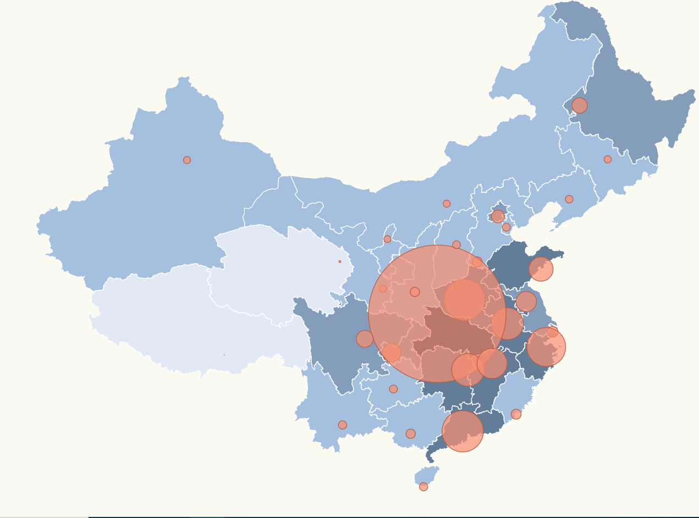

# Pinning locations China + Radius scale + Background Scale

In previous tasks we have made a different versions with maps of Spain, however in this case let's look at the last version with background scale and radius scale with the map of China. Sounds good right? So, Let's start with this!



# Steps

We will take as starting point our previous example: _data-visualization-advanced_ let's copy the content from that folder and execute _npm install_.

```bash
npm start
```

First of all, let's create the map of China this was done recollecting the format topojson in the account's Github of [deldersveld](https://github.com/deldersveld/topojson/tree/master/countries/china). I recommend to visit his profile due to there are a lot of interesting maps with format topojson to make maps like this for example. We must copy this content in a new file with this directory _./src/china.json_

Then, let's import topojson converter and we load the json map using require,before removing the format topojson of Spain.

```diff
  import * as d3 from "d3";
  import * as topojson from "topojson-client";
- const spainjson = require("./spain.json");
+ const chinajson = require("./china.json");
```
Now we must modify our scale due to at this moment we have a scale for the map of Spain not for China. After proving with different values the suitable for the map of China are _900_ for scale and _[-1100, 1000]_ for translate.

_./src/index.ts_

```diff
   const aProjection = d3
   .geoMercator()
+  .scale(900)
-  .scale(3300)
+  .translate([-1100, 1000]);
-  .translate([500, 400]);
```
Good! Once we have defined our projection we have to select all provinces in the topojson file.
```diff
   const geojson = topojson.feature(
+  chinajson,
-  spainjson,
+  chinajson.objects.CHN_adm1
-  spainjson.objects.ESP_adm1
);
```
The communities have been created too, this information will be placed at _./src/communities.ts_

_./src/communities.ts_
```ts
export const latLongCommunities = [
  {
    name: "Anhui",
    long: 117.2808304,
    lat: 31.8638897
  },
  {
    name: "Beijing",
    long: 116.3972321,
    lat: 39.9075012
  },
  {
    name: "Chongqing",
    long: 106.5527802,
    lat: 29.5627804
  },
  {
    name: "Fujian",
    long: 118.081871,
    lat: 24.4797897
  },
  {
    name: "Gansu",
    long: 105.7423782,
    lat: 34.5795212
  },
  {
    name: "Guangdong",
    long: 113.1314774,
    lat: 23.0267696
  },
  {
    name: "Guangxi",
    long: 108.3166733,
    lat: 22.8166695
  },
  {
    name: "Guizhou",
    long: 106.7166672,
    lat: 26.5833302
  },
  {
    name: "Hainan",
    long: 109.5102768,
    lat: 18.2205601
  },
  {
    name: "Hebei",
    long: 114.4677811,
    lat: 36.6005592
  },
  {
    name: "Heilongjiang",
    long: 123.9604492,
    lat: 47.3408813
  },
  {
    name: "Henan",
    long: 113.3011932,
    lat: 33.7384682
  },
  {
    name: "Hubei",
    long: 110.7780609,
    lat: 32.6474991
  },
  {
    name: "Hunan",
    long: 113.6270905,
    lat: 28.1586094
  },
  {
    name: "Jiangsu",
    long: 119.0191727,
    lat: 33.5886116
  },
  {
    name: "Jiangxi",
    long: 115.8530579,
    lat: 28.68396
  },
  {
    name: "Jilin",
    long: 126.56027989,
    lat: 43.8508301
  },
  {
    name: "Liaoning",
    long: 122.9899979,
    lat: 41.1236115
  },
  {
    name: "Nei Mongol",
    long: 111.6522217,
    lat: 40.8105583
  },
  {
    name: "Ningxia Hui",
    long: 106.1614,
    lat: 38.28
  },
  {
    name: "Qinghai",
    long: 101.7573929,
    lat: 36.6255417
  },
  {
    name: "Shaanxi",
    long: 108.7026062,
    lat: 34.33778
  },
  {
    name: "Shandong",
    long: 120.3804169,
    lat: 36.0648804
  },
  {
    name: "Shanghai",
    long: 121.4580612,
    lat: 31.2222195
  },
  {
    name: "Shanxi",
    long: 112.5602798,
    lat: 37.8694382
  },
  {
    name: "Sichuan",
    long: 104.0666733,
    lat: 30.6666698
  },
  {
    name: "Tianjin",
    long: 117.1766663,
    lat: 39.1422195
  },
  {
    name: "Xinjiang Uygur",
    long: 87.6004562,
    lat: 43.8009605
  },
  {
    name: "Xizang",
    long: 91.06,
    lat: 29.39
  },
  {
    name: "Yunnan",
    long: 102.0041733,
    lat: 23.5711002
  },
  {
    name: "Zhejiang",
    long: 120.871109,
    lat: 30.0155602
  }
];
```
We don't need to import into our _index.ts_ file cause we have previously created this file for the communities of Spain.

The stats of people infected for Coronavirus per province were created with 3 dates 22-01-2020, 23-02-2020, 23-03-2020. 

_stats.ts_
```ts
export interface ResultEntry {
  name: string;
  value: number;
}
export const stats22January: ResultEntry[] = [
  {
    name: "Anhui",
    value: 1
  },
  {
    name: "Beijing",
    value: 14
  },
  {
    name: "Chongqing",
    value: 6
  },
  {
    name: "Fujian",
    value: 1
  },
  {
    name: "Gansu",
    value: 0
  },
  {
    name: "Guangdong",
    value: 26
  },
  {
    name: "Guangxi",
    value: 2
  },
  {
    name: "Guizhou",
    value: 1
  },
  {
    name: "Hainan",
    value: 4
  },
  {
    name: "Hebei",
    value: 1
  },
  {
    name: "Heilongjiang",
    value: 0
  },
  {
    name: "Henan",
    value: 5
  },
  {
    name: "Hubei",
    value: 444
  },
  {
    name: "Hunan",
    value: 4
  },
  {
    name: "Jiangsu",
    value: 1
  },
  {
    name: "Jiangxi",
    value: 2
  },
  {
    name: "Jilin",
    value: 0
  },
  {
    name: "Liaoning",
    value: 2
  },
  {
    name: "Nei Mongol",
    value: 0
  },
  {
    name: "Ningxia Hui",
    value: 1
  },
  {
    name: "Qinghai",
    value: 0
  },
  {
    name: "Shaanxi",
    value: 0
  },
  {
    name: "Shandong",
    value: 2
  },
  {
    name: "Shanghai",
    value: 9
  },
  {
    name: "Shanxi",
    value: 1
  },
  {
    name: "Sichuan",
    value: 5
  },
  {
    name: "Tianjin",
    value: 4
  },
  {
    name: "Xinjiang Uygur",
    value: 0
  },
  {
    name: "Xizang",
    value: 0
  },
  {
    name: "Yunnan",
    value: 1
  },
  {
    name: "Zhejiang",
    value: 10
  }
]

export const stats23February: ResultEntry[] = [
  {
    name: "Anhui",
    value: 989
  },
  {
    name: "Beijing",
    value: 399
  },
  {
    name: "Chongqing",
    value: 575
  },
  {
    name: "Fujian",
    value: 293
  },
  {
    name: "Gansu",
    value: 91
  },
  {
    name: "Guangdong",
    value: 1342
  },
  {
    name: "Guangxi",
    value: 249
  },
  {
    name: "Guizhou",
    value: 146
  },
  {
    name: "Hainan",
    value: 168
  },
  {
    name: "Hebei",
    value: 311
  },
  {
    name: "Heilongjiang",
    value: 480
  },
  {
    name: "Henan",
    value: 1271
  },
  {
    name: "Hubei",
    value: 64084
  },
  {
    name: "Hunan",
    value: 1016
  },
  {
    name: "Jiangsu",
    value: 631
  },
  {
    name: "Jiangxi",
    value: 934
  },
  {
    name: "Jilin",
    value: 91
  },
  {
    name: "Liaoning",
    value: 121
  },
  {
    name: "Nei Mongol",
    value: 75
  },
  {
    name: "Ningxia Hui",
    value: 71
  },
  {
    name: "Qinghai",
    value: 18
  },
  {
    name: "Shaanxi",
    value: 245
  },
  {
    name: "Shandong",
    value: 754
  },
  {
    name: "Shanghai",
    value: 335
  },
  {
    name: "Shanxi",
    value: 132
  },
  {
    name: "Sichuan",
    value: 526
  },
  {
    name: "Tianjin",
    value: 135
  },
  {
    name: "Xinjiang Uygur",
    value: 76
  },
  {
    name: "Xizang",
    value: 1
  },
  {
    name: "Yunnan",
    value: 174
  },
  {
    name: "Zhejiang",
    value: 1205
  }
]

export const stats23March: ResultEntry[] = [
  {
    name: "Anhui",
    value: 990
  },
  {
    name: "Beijing",
    value: 537
  },
  {
    name: "Chongqing",
    value: 577
  },
  {
    name: "Fujian",
    value: 313
  },
  {
    name: "Gansu",
    value: 136
  },
  {
    name: "Guangdong",
    value: 1415
  },
  {
    name: "Guangxi",
    value: 254
  },
  {
    name: "Guizhou",
    value: 146
  },
  {
    name: "Hainan",
    value: 168
  },
  {
    name: "Hebei",
    value: 319
  },
  {
    name: "Heilongjiang",
    value: 484
  },
  {
    name: "Henan",
    value: 1274
  },
  {
    name: "Hubei",
    value: 67800
  },
  {
    name: "Hunan",
    value: 1018
  },
  {
    name: "Jiangsu",
    value: 633
  },
  {
    name: "Jiangxi",
    value: 936
  },
  {
    name: "Jilin",
    value: 93
  },
  {
    name: "Liaoning",
    value: 127
  },
  {
    name: "Nei Mongol",
    value: 75
  },
  {
    name: "Ningxia Hui",
    value: 75
  },
  {
    name: "Qinghai",
    value: 18
  },
  {
    name: "Shaanxi",
    value: 248
  },
  {
    name: "Shandong",
    value: 768
  },
  {
    name: "Shanghai",
    value: 404
  },
  {
    name: "Shanxi",
    value: 133
  },
  {
    name: "Sichuan",
    value: 543
  },
  {
    name: "Tianjin",
    value: 141
  },
  {
    name: "Xinjiang Uygur",
    value: 76
  },
  {
    name: "Xizang",
    value: 1
  },
  {
    name: "Yunnan",
    value: 176
  },
  {
    name: "Zhejiang",
    value: 1238
  }
];
];
```
Let's import these new stats in our _index.ts_
_./src/index.ts_

```diff
  import * as d3 from "d3";
  import * as topojson from "topojson-client";
  const chinajson = require("./china.json");
  import { latLongCommunities } from "./communities";
+ import { stats22January, stats23February,stats23March, ResultEntry } from "./stats";
```
As it was previously told we have three different stats instead of two like the last version of Spain, so that we need to update our _index.html_

_./src/index.html_
```diff
<html>
  <head>
    <link rel="stylesheet" type="text/css" href="./map.css" />
    <link rel="stylesheet" type="text/css" href="./base.css" />
  </head>
  <body>
+    <button id="22January">22/01/2020</button>
+    <button id="23February">23/02/2020</button>
+    <button id="23March">23/03/2020</button>
    <script src="./index.ts"></script>
  </body>
</html>
```
At the end it
 is necessary to update the three different buttom in our index.ts. 

_./src/index.ts_
```diff
document
+  .getElementById("22January")
+  .addEventListener("click",
+  function handleInfected22January() {
    updateColorsAndRadius(stats22January);});
document
+  .getElementById("23February")
+  .addEventListener("click",
+  function handleInfected23February() {
    updateColorsAndRadius(stats23February);});
document
+  .getElementById("23March")
+  .addEventListener("click",
+  function handleInfected23March() {
    updateColorsAndRadius(stats23March);});
```
Good job! This task ends here! Hope you enjoy making this funny exercise.

If you would like to see the final result:

```bash
npm start
```